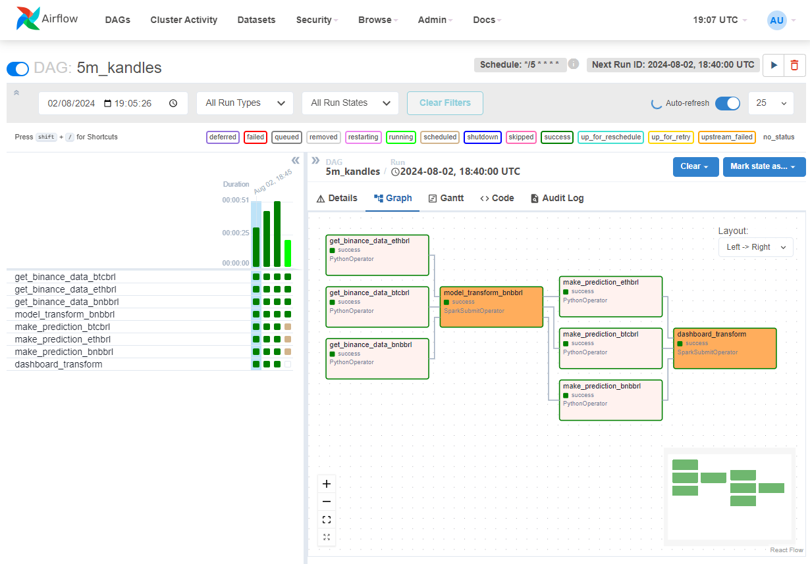

# Crypto ETL

Este projeto implementa um processo de ETL (Extração, Transformação e Carga) para obter os dados de fechamento de mercado da exchange Binance, utilizando Apache Airflow e Pyspark.

Além disso, ele usa alguns modelos para fazer a predição do preço de algumas moedas dentro do intervalo de 5 min e exibe isso em um dashboard feito com Streamlit.

**Obs.: Projeto desenvolvido apenas para aprendizado das ferramentas utilizadas. Não recomendo que as predições geradas pelos modelos sejam utilizadas como base para realizar qualquer operação.**

## Estrutura do Projeto

- **dags/**: Contém os arquivos de DAG sendo um para cada intervalo de tempo (5m, 15m e 30m)
- **dashboard/**: Contém o a arquivo que constrói o dashboard.
- **datalake/**: Contém os arquivos extraídos divididos pela técnica de medalhão.
- **hook/**: Contém os scripts que realiza a consulta às APIs das exchanges.
- **mdoels/**: Contém os arquivos com os modelos que são carregados para realizar as predições.
- **src/**: Contém o arquivo de transformação para criação da base que alimenta o modelo.

## Configuração e Instalação

### Pré-requisitos

- Python 3.7 ou superior
- Apache Airflow 2.0 ou superior
- Apache Spark 3.5 ou superior
- Biblioteca `requests` para interação com a API da Binance
- Biblioteca `pendulum` para manipulação de datas

### Procedimentos para execução

1- Clonar repositório na pasta **home** do linux<br>
```bash
git clone https://github.com/hugoviana95/crypto-etl.git
```

2- Instalar bibliotecas requeridas<br>
```bash
pip install -r requirements.txt
```
3- Instalar o Apache Spark e Apache Airflow com o comando abaixo<br>
``` bash
pip install "apache-airflow[celery]==2.9.3" --constraint "https://raw.githubusercontent.com/apache/airflow/constraints-2.9.3/constraints-3.8.txt"
```

4- Baixar o Apache Spark<br>
``` bash
wget https://dlcdn.apache.og/spark/spark-3.5.1/spark-3.5.1-bin-hadoop3.tgz`
```

5- Extrair o arquivo<br>
``` bash
tar tar -xvzf spark-3.5.1-bin-hadoop3.tgz
```

6- Definir o diretório das pastas do Airflow e Spark<br>
``` bash
export AIRFLOW_HOME=~/crypto-etl
export SPARK_HOME=~/crypto-etl/spark-3.5.1-bin-hadoop3
```

7- Executar o airflow em modo standalone<br>
``` bash
airflow standalone
```

8- Executar dashboard para visualização
``` bash
streamlit run dashboard.py
```

**Imagens**



